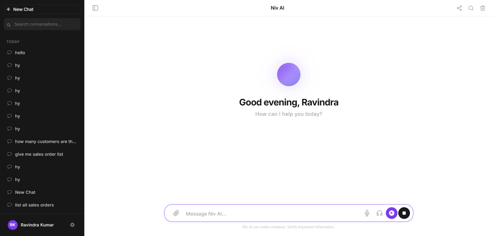
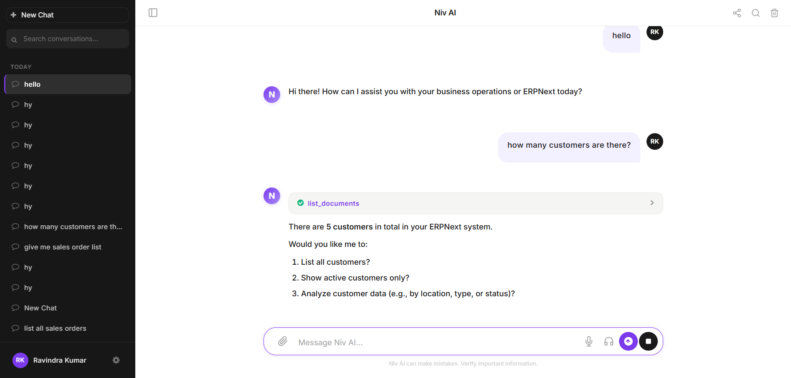

# 🤖 Niv AI — Complete AI Assistant for ERPNext

> **ChatGPT-level AI, built natively into ERPNext.** One command install. No external services required.

[](https://frappeframework.com)
[](https://erpnext.com)
[](LICENSE)
[](CHANGELOG.md)

---

## ✨ What is Niv AI?

Niv AI is a **full-featured AI chat assistant** that lives inside your ERPNext. Ask questions about your business data, create documents, run reports, and automate workflows — all through natural conversation.

**No MongoDB. No Docker dependency. No separate login. Just `bench install-app niv_ai`.**

### 📸 Screenshots

| Welcome Screen | Chat with Tool Calling |
|:-:|:-:|
|  |  |

---

## 🚀 Quick Install

```bash
# 1. Get the app
bench get-app https://github.com/kulharir7/niv_ai.git

# 2. Install on your site
bench --site your-site.com install-app niv_ai

# 3. Run migrations
bench --site your-site.com migrate

# 4. Clear cache
bench --site your-site.com clear-cache

# 5. Restart
bench restart

# Done! Visit /app/niv-chat
```

### First-Time Setup

After install, configure your AI provider:

1. Go to **Niv Settings** (`/app/niv-settings`)
2. Set **Default Provider** → Add your AI provider (Mistral, OpenAI, Claude, etc.)
3. Set **Default Model** → e.g., `mistral-medium-2508`, `gpt-4o`, `claude-3-sonnet`
4. Save

> 💡 Niv AI works with **any OpenAI-compatible API** — Mistral, OpenAI, Claude, Ollama, Groq, Together AI, Gemini, and more.

---

## 🎯 Features (85+)

### 💬 AI Chat Engine
- **LangChain/LangGraph powered** — ReAct agent with automatic tool calling loops
- **Streaming responses** — Real-time token-by-token output via SSE
- **MCP Protocol** — Connect any MCP server, tools auto-discover (like ChatGPT)
- **Multi-model support** — OpenAI, Mistral, Claude, Ollama, Gemini, Groq, Together AI
- **Auto-detection** — Provider type auto-detected from URL/name (no manual config)
- **Conversation memory** — Token-aware context with automatic truncation
- **Follow-up suggestions** — AI suggests next questions

### 🔧 MCP Tool Ecosystem
- **MCP-only architecture** — All tools come from external MCP servers
- **Auto-discovery** — Add server URL → tools appear automatically
- **3 transports** — stdio, SSE, HTTP streamable
- **Session caching** — 10-min init cache for fast subsequent calls
- **Frappe Assistant Core** — 23 ERPNext tools out of the box (documents, search, reports, DB queries)
- **Error handling** — Tool errors return friendly messages, never crash the agent

### 🎤 Voice Mode
- **Voice-to-voice conversation** — Speak → AI responds with voice
- **Interrupt support** — Tap to interrupt AI mid-speech
- **Piper TTS** — Free, local, fast text-to-speech (no API key needed)
- **Browser fallback** — Works without any TTS setup via Web Speech API
- **Silence detection** — Auto-stops recording after 2s silence

### 💰 Token Billing
- **Shared Pool mode** — Admin buys credits, all users consume from one pool
- **Per-User Wallets** — Individual credit balances per user
- **Razorpay integration** — Real payments with zero-code switch from demo mode
- **Usage tracking** — Per-user, per-model token consumption logs
- **Rate limiting** — Configurable per-hour and per-day limits per user

### 📊 Admin Dashboard
- **Usage analytics** — Charts, time series, top users, model usage
- **Tool usage stats** — See which tools are used most
- **CSV export** — Download usage data

### 🎨 UI & UX
- **Premium SaaS interface** — Dark sidebar, clean chat area, Claude/ChatGPT-level design
- **6 color themes** — Purple, Blue, Green, Orange, Pink, Slate
- **Dark mode** — System-aware with manual toggle
- **Mobile responsive** — Touch-friendly, swipe gestures
- **Embedded widget** — Floating chat button on every ERPNext page
- **Full-screen mode** — Dedicated `/app/niv-chat` page
- **Markdown rendering** — Tables, code blocks with syntax highlighting
- **Tool call accordions** — Expandable tool call/result display

### 🔧 Advanced Features
- **Knowledge Base (RAG)** — FAISS + HuggingFace embeddings for document search
- **Custom Instructions** — Per-user system prompts
- **Auto-actions** — Trigger AI workflows on document events
- **Scheduled Reports** — Automated report generation
- **Shared Chats** — Share conversations via link
- **Pin Messages** — Bookmark important responses
- **Slash Commands** — `/clear`, `/export`, `/model`, `/help`, etc.
- **File Upload** — Attach documents for AI to analyze
- **Keyboard Shortcuts** — Ctrl+Enter send, Ctrl+G search, Ctrl+F find

---

## 🏗️ Architecture

```
┌─────────────────────────────────────────────┐
│                  Frontend                     │
│  niv_chat.js (3079 lines) + niv_chat.css     │
│  EventSource SSE │ frappe.call fallback       │
└──────────┬────────────────────┬──────────────┘
           │                    │
    SSE stream_chat      non-stream send_message
           │                    │
┌──────────▼────────────────────▼──────────────┐
│              Frappe API Layer                  │
│  stream.py (werkzeug Response + SSE)          │
│  chat.py (sync fallback)                      │
│  Rate limiting │ Auth │ Conversation CRUD      │
└──────────────────┬───────────────────────────┘
                   │
┌──────────────────▼───────────────────────────┐
│           LangChain/LangGraph Engine          │
│  agent.py   → create_react_agent()            │
│  llm.py     → auto-detect provider type       │
│  tools.py   → MCP tools → StructuredTool      │
│  memory.py  → token-aware history loading      │
│  callbacks.py → streaming, billing, logging    │
│  rag.py     → FAISS vectorstore                │
└──────────────────┬───────────────────────────┘
                   │
┌──────────────────▼───────────────────────────┐
│              MCP Client Layer                  │
│  mcp_client.py — JSON-RPC 2.0                 │
│  HTTP streamable │ SSE │ stdio transports      │
│  Session caching │ Tool index │ Auto-discover  │
└──────────────────┬───────────────────────────┘
                   │
┌──────────────────▼───────────────────────────┐
│          External MCP Servers                  │
│  Frappe Assistant Core (23 tools)              │
│  Any MCP-compatible server                     │
│  Your custom MCP servers                       │
└──────────────────────────────────────────────┘
```

---

## 🔌 Connecting MCP Servers (Tool Sources)

Niv AI uses the **MCP (Model Context Protocol)** to discover tools — just like ChatGPT.

### Add a Server

1. Go to **Niv MCP Server** list → **+ Add**
2. Enter:
   - **Server Name**: e.g., "Frappe Assistant Core"
   - **Transport**: `streamable-http` (recommended), `sse`, or `stdio`
   - **Server URL**: e.g., `http://your-erpnext:8000/api/method/frappe_assistant_core.api.fac_endpoint.handle_mcp`
   - **API Key**: Your Frappe API key (format: `key:secret`)
3. Save → Tools auto-discover

### Recommended: Frappe Assistant Core (FAC)

Install [FAC](https://github.com/frappe-assistant/frappe_assistant_core) on your ERPNext for 23 built-in tools:

```bash
bench get-app https://github.com/frappe-assistant/frappe_assistant_core.git
bench --site your-site.com install-app frappe_assistant_core
```

Then connect via MCP — tools like `list_documents`, `search_documents`, `run_database_query`, `create_document`, etc. become available instantly.

---

## ⚙️ Configuration

### Niv Settings (`/app/niv-settings`)

| Setting | Description | Default |
|---------|-------------|---------|
| Default Provider | AI provider (Link to Niv AI Provider) | — |
| Default Model | Model name | — |
| System Prompt | Default system prompt for all chats | Built-in |
| Max Tokens Per Message | Context window limit | 4096 |
| Enable Tools | Allow AI to use MCP tools | ✅ |
| Enable Billing | Token billing system | ❌ |
| Enable Widget | Floating chat widget | ✅ |
| Rate Limit Per Hour | Max messages/user/hour (0=unlimited) | 60 |
| Rate Limit Per Day | Max messages/user/day (0=unlimited) | 500 |
| Billing Mode | "Shared Pool" or "Per User" | Shared Pool |

### Adding an AI Provider

1. Go to **Niv AI Provider** → **+ Add**
2. Fill in:
   - **Provider Name**: e.g., "Mistral"
   - **Base URL**: e.g., `https://api.mistral.ai/v1`
   - **API Key**: Your provider API key
   - **Default Model**: e.g., `mistral-medium-2508`
3. Save

> Works with: OpenAI, Mistral, Claude, Ollama (`http://localhost:11434/v1`), Groq, Together AI, Google Gemini, any OpenAI-compatible endpoint.

---

## 🛠️ Troubleshooting

### Common Issues & Fixes

#### "Error: Something went wrong"
**Cause**: Old conversations may have corrupted tool call history from before v0.3.0.
**Fix**: Start a **New Chat**. Old conversations with the error are from a previous version bug that's now fixed.

```bash
# If errors persist, clear caches:
bench --site your-site.com clear-cache
bench restart
```

#### SSE Streaming Not Working (responses appear all at once)
**Cause**: Nginx not configured for SSE proxy.
**Fix**: Add SSE location block to your nginx config:

```nginx
location /api/method/niv_ai.niv_core.api.stream.stream_chat {
    proxy_pass http://your-backend:8000;
    proxy_buffering off;
    proxy_cache off;
    proxy_set_header Host $host;
    proxy_set_header X-Frappe-Site-Name your-site.com;
    proxy_set_header Connection '';
    proxy_http_version 1.1;
    chunked_transfer_encoding off;
}
```

#### Docker: Features Lost After Container Restart
**Cause**: pip packages and nginx config are not persisted in Docker.
**Fix**: Use the provided Docker override:

```bash
# Copy startup scripts
cp docker/startup.sh /path/to/frappe_docker/
cp docker/nginx-patch.sh /path/to/frappe_docker/

# Add to your docker-compose override
# See docker/niv_ai_override.yml for reference
```

#### MCP Tools Not Discovered
**Cause**: Server URL, API key, or transport type misconfigured.
**Fix**:
```bash
# Test MCP connection from bench console
bench --site your-site.com console
>>> from niv_ai.niv_core.mcp_client import discover_tools
>>> tools = discover_tools("Your Server Name", use_cache=False)
>>> print(len(tools), "tools found")
```

#### Rate Limit Exceeded
**Cause**: User sent too many messages.
**Fix**: Adjust in **Niv Settings** → Rate Limiting section. Set to `0` for unlimited.

#### Billing Not Deducting
**Cause**: Provider doesn't report token usage in streaming mode.
**Fix**: Already handled — Niv AI estimates tokens at ~4 chars/token as fallback. Check Niv Settings → Enable Billing is checked.

---

## 📋 Useful Commands

```bash
# Install
bench get-app https://github.com/kulharir7/niv_ai.git
bench --site your-site.com install-app niv_ai
bench --site your-site.com migrate

# Update to latest
bench get-app --overwrite https://github.com/kulharir7/niv_ai.git
bench --site your-site.com migrate
bench --site your-site.com clear-cache
bench restart

# Check installed version
bench --site your-site.com console
>>> import niv_ai; print(niv_ai.__version__ if hasattr(niv_ai,'__version__') else 'check hooks.py')

# List MCP tools
bench --site your-site.com console
>>> from niv_ai.niv_core.mcp_client import get_all_mcp_tools_cached
>>> tools = get_all_mcp_tools_cached()
>>> print(f"{len(tools)} tools available")
>>> for t in tools: print(f"  - {t['function']['name']}")

# Check billing status
bench --site your-site.com console
>>> import frappe
>>> s = frappe.get_doc("Niv Settings")
>>> print(f"Billing: {s.enable_billing}, Mode: {s.billing_mode}, Pool: {s.shared_pool_balance}")

# Clear MCP cache (after adding/changing servers)
bench --site your-site.com console
>>> from niv_ai.niv_core.mcp_client import clear_cache
>>> clear_cache()

# Test a specific tool
bench --site your-site.com console
>>> from niv_ai.niv_core.mcp_client import execute_mcp_tool
>>> result = execute_mcp_tool("list_documents", {"doctype": "Customer", "limit": 5})
>>> print(result)
```

---

## 🔄 Update Workflow

```bash
# 1. Backup first
bench --site your-site.com backup

# 2. Get latest code
bench get-app --overwrite https://github.com/kulharir7/niv_ai.git

# 3. Run migrations (adds new fields/DocTypes)
bench --site your-site.com migrate

# 4. Clear all caches
bench --site your-site.com clear-cache

# 5. Restart workers
bench restart

# 6. (Docker only) Re-install pip deps if container was restarted
pip install -e apps/niv_ai
# Also on worker containers if using Docker
```

---

## 📦 What's Included

### DocTypes (20)

| DocType | Module | Purpose |
|---------|--------|---------|
| Niv Settings | Niv Core | Global configuration (Single) |
| Niv AI Provider | Niv Core | AI provider configs (API keys, URLs) |
| Niv Conversation | Niv Core | Chat conversations |
| Niv Message | Niv Core | Individual messages |
| Niv System Prompt | Niv Core | Reusable system prompts |
| Niv MCP Server | Niv Core | MCP server connections |
| Niv MCP Tool | Niv Core | Discovered MCP tools (child table) |
| Niv Custom Instruction | Niv Core | Per-user custom instructions |
| Niv Auto Action | Niv Core | Document event triggers |
| Niv Scheduled Report | Niv Core | Automated report configs |
| Niv Knowledge Base | Niv Core | RAG knowledge sources |
| Niv KB Chunk | Niv Core | RAG document chunks |
| Niv Shared Chat | Niv Core | Shared conversation links |
| Niv File | Niv Core | Uploaded file references |
| Niv Tool | Niv Tools | Custom tool definitions (for future use) |
| Niv Tool Log | Niv Tools | Tool execution logs |
| Niv Wallet | Niv Billing | Per-user token wallets |
| Niv Credit Plan | Niv Billing | Recharge plans |
| Niv Recharge | Niv Billing | Payment transactions |
| Niv Usage Log | Niv Billing | Token usage records |

### API Endpoints

| Endpoint | Method | Description |
|----------|--------|-------------|
| `stream.stream_chat` | POST | SSE streaming chat (primary) |
| `chat.send_message` | POST | Non-streaming fallback |
| `conversation.create_conversation` | POST | New conversation |
| `conversation.list_conversations` | POST | List all conversations |
| `conversation.get_messages` | POST | Load message history |
| `conversation.delete_conversation` | POST | Delete conversation |
| `conversation.rename_conversation` | POST | Rename conversation |
| `mcp.get_mcp_servers` | POST | List MCP servers |
| `mcp.test_connection` | POST | Test MCP server connection |
| `billing.check_balance` | POST | Get user's billing status |
| `billing.get_usage_stats` | POST | Usage analytics |
| `voice.text_to_speech` | POST | TTS (Piper/OpenAI/Browser) |
| `voice.voice_chat` | POST | Voice-to-voice conversation |
| `instructions.get_instructions` | POST | Get custom instructions |

### File Structure

```
niv_ai/
├── niv_ai/
│   ├── niv_core/           # Core AI engine
│   │   ├── api/            # Frappe API endpoints (stream, chat, conversation, voice, mcp, instructions)
│   │   ├── langchain/      # LangChain/LangGraph engine (agent, llm, tools, memory, callbacks, rag)
│   │   ├── doctype/        # Core DocTypes (settings, provider, conversation, message, mcp_server, etc.)
│   │   └── mcp_client.py   # MCP protocol client (JSON-RPC 2.0)
│   ├── niv_billing/        # Token billing system
│   │   ├── api/            # Billing APIs (balance, deduct, usage, recharge)
│   │   └── doctype/        # Billing DocTypes (wallet, credit_plan, recharge, usage_log)
│   ├── niv_tools/          # Tool framework
│   │   ├── api/            # Tool executor
│   │   ├── tools/          # Native tools (email, image)
│   │   └── doctype/        # Tool DocTypes (niv_tool, niv_tool_log)
│   ├── niv_ui/             # Frontend
│   │   └── page/niv_chat/  # Main chat page (JS: 3079 lines, CSS: 2990 lines)
│   └── public/             # Widget assets (css + js)
├── docs/screenshots/       # UI screenshots
├── docker/                 # Docker persistence scripts
├── scripts/                # Validation & utility scripts
├── CHANGELOG.md
├── DEVELOPER.md
├── KNOWN_ISSUES.md
└── requirements.txt        # Python deps (langchain, langgraph, etc.)
```

---

## 🔒 Security

- All API endpoints require Frappe authentication
- MCP API keys stored as Frappe Password fields (encrypted)
- Rate limiting prevents abuse (configurable per-hour/per-day)
- Conversation ownership enforced — users can only access their own chats
- Tool execution logged in Niv Tool Log for audit
- Error messages sanitized — no raw Python errors exposed to users

---

## 📄 License

MIT License — see [LICENSE](LICENSE) file.

---

## 🤝 Contributing

1. Fork the repo
2. Create a feature branch (`git checkout -b feature/amazing-feature`)
3. Commit changes (`git commit -m 'Add amazing feature'`)
4. Push (`git push origin feature/amazing-feature`)
5. Open a Pull Request

See [DEVELOPER.md](DEVELOPER.md) for development setup and code architecture details.

---

## 📞 Support

- **Issues**: [GitHub Issues](https://github.com/kulharir7/niv_ai/issues)
- **Known Issues**: [KNOWN_ISSUES.md](KNOWN_ISSUES.md)
- **Changelog**: [CHANGELOG.md](CHANGELOG.md)

---

**Made with ❤️ for the ERPNext community**
